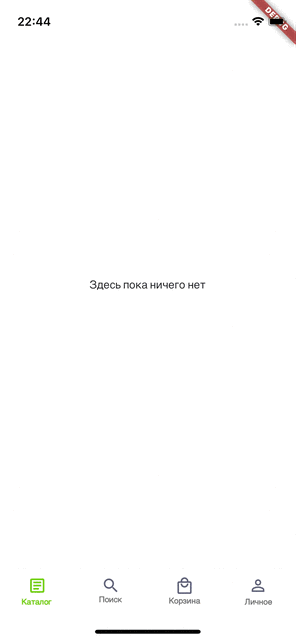

# Description of your result

Receipt page with various type of sorting

## Description

Create layout from figma. Create data layer for mock loading data from server. Write utils classes and extensions for comfortable using in ui. Write sort algorithm's. Connect data layer to ui with sorting function.  

## How to

cd task-12

dart bin/main.dart

## Demo

