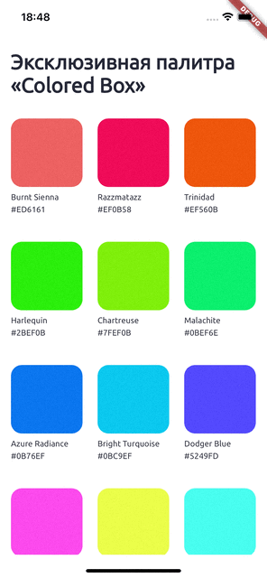

# Description of your result

Color palette with buffering hex color, include buffer change when app is hide
## Description

Create layout from figma. Create data layer for mock loading data from server. Create simple state manager for managing state through pages using context. Create read and write buffer logic.

## How to

cd task-13

dart bin/main.dart

## Demo

