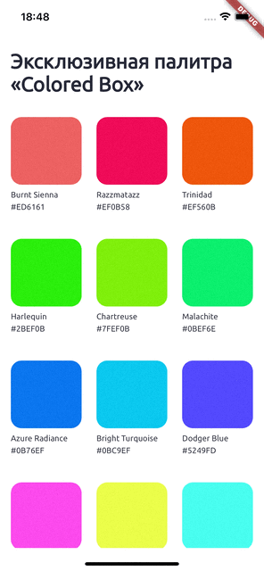

# Description of your result

App which support dark and light mode with three color schemes 

## Description

Separating themes by analyzing figma, create layout. Create app color schemes with text schemes. Integrate one to ui;

## How to

cd task-14

dart bin/main.dart

## Demo

