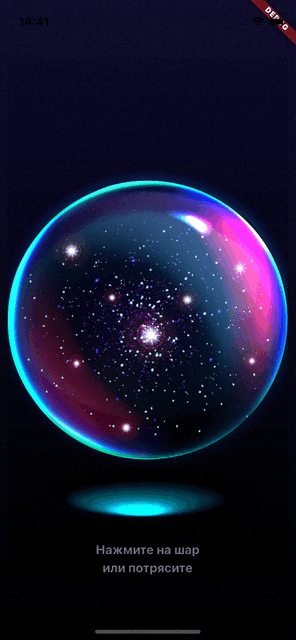

# Description of your result
Magic ball with the predictions
## Description
Create layout from figma. Add animations to the ball. Add data layer with controller for requesting reply. Add shake gesture service for detecting gestures.
## How to
cd task-16

dart bin/main.dart
## Demo

